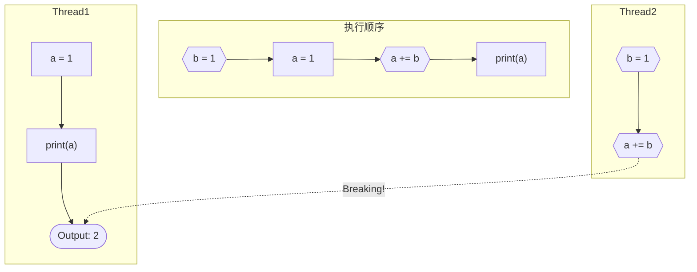

# Python 异步教程

> 感谢 [BlueGlassBlock](https://github.com/BlueGlassBlock) 对本文内容的勘误和补充。

Python 从 3.4 开始引入了 asyncio 库，提供异步协程支持，从 Python 3.4 到 3.7，对异步的支持一直在不断地进步。可以说，异步就是 Python 未来的趋势之一。

在了解异步之前，你可能已经接触过或听说过很多类似的概念，比如“并发”“并行”“多线程”等等，这么多名词，再加上一个“异步”，让人有些混乱。

不过，虽然看起来很复杂，但是，通过这篇教程，我相信你能够对“异步”和“协程”有一个清晰的把握。

以下是这篇教程涵盖的内容：

- 异步：一种编程范式，独立于编程语言，可以具有多种语言的不同实现。
- async/await：两个新的 Python 关键字，用于规定异步逻辑。
- asyncio：一个 Python 内置的包，提供协程的基础功能和管理协程的方法。

## 什么是异步？

在讲异步之前，需要先知道一个与之相对的概念：同步。

其实同步对我们而言并不陌生。在接触到异步之前，我们认知的一切都是同步的。我们可以想象代码一句一句地执行，遇到函数就进入，执行完函数再执行函数后面的东西，所有的执行顺序都严格地和代码书写的顺序一致——这就是同步。

比如这样的代码：

```python
import time

print(1)
time.sleep(10)
print(2)
```

我们可以清晰地预知它的行为：先打印 1，然后等待 10 秒，最后打印 2。

同步最大的优点是**思路清晰**。**你永远可以知道你的程序是按照怎样的顺序执行的，不用担心任何意料之外的情况**。

但同时，同步也有不可避免的缺点：在某些情境下，它会带来性能的浪费。

以一个生活中的场景为例：你在网上下载一个文件，但是文件很大，需要很长时间才能下完。这时候，你肯定不会盯着进度条一点点走，而是去做点别的事情，读一会书，看一会电影，之类的。

但如果有一个完全“同步”的人，他为自己设定的程序是下载这个文件，然后运行它，这样的话，他为了不让自己的运行逻辑乱掉，就会一直守在电脑前，直到文件下载完成才做下一步的工作。正常人肯定不能忍受这样无聊的等待，也不会希望自己的程序在这种无聊的事上浪费时间。

为了能充分利用这些可能被浪费掉的时间，人们想出过很多方法，比如**多线程**，比如**回调**。

多线程是最容易想到的一种方式了。我们可以创建多个线程，每个线程内部是同步的，再让这些线程同时运行。这样，在一个线程等待的时候，其余的线程可以继续运行，不会因此停止。

这看上去十分美好，然而现实并不像我们想象得那么简单。虽然线程各自内部的代码是同步的，但不同线程之间的代码执行顺序已经无从确定。换言之，我们引入了“异步”。**代码的执行顺序与书写顺序不一致的现象就是异步**。

熟悉多线程的人应该了解过“锁”的各种花样。两个线程共享资源时，如果同时对同一个变量进行修改，就有可能导致出乎预料的情况。所以人们发明了“锁”，来保证同一时刻只有唯一的线程对某一个变量进行修改。可以说，“锁”是为了制服异步而发明的。



如此看来，异步似乎是一件不太好的事情。它让程序的运行平添了一种不可控的随意性，我们不再能看到代码就直接推演出结果，因为即使是相邻书写的僵局代码，之间也可能会有别的代码执行。

但是**异步相较于同步而言，带来的性能提升实在是太诱人了**。一个网站的服务器，如果是同步的，那么它同时只能让一个用户访问——这简直是不可理喻的事情。异步就像几万年前蹲踞在草原清冷的月光下，用锐利的眼神眺望人类营地篝火的一只秀美的狼，而猎手们则思考着如何给它套上项圈，变成自己忠实的猎犬。

所以，多线程、回调，包括协程，这一系列设计，与其说是为了充分利用计算资源，不如说是为了**在人类可理解的范畴内，更好地制服异步**。

## 锁的“困境”

多线程和锁的结合，至今仍然是异步编程的最佳选择之一。因此，怎么加锁、在何处加锁，就成为了一门重要的学问。

锁是个好东西，但是不能有太多。一方面，反复地获取锁释放锁会占用运行时间；另一方面，当一个线程长时间持有某个锁时，其他的线程如果想要访问这个资源，也必须在原地等待，**极端情况下，同一时间只有一个线程在执行！**

人们在优化锁的使用上花了很大工夫，从中衍生出的各种理论此处不再赘述。随着锁的使用方式逐渐变得复杂，人们发现，如果想要完美地控制锁的粒度，就不得不对花大量的代码去精细地控制每一个锁，这让编写代码的难度大大提高了。

有的时候，控制锁带来的复杂度已经超出了人能忍受的范围。于是我们经常见到许多简单粗暴的操作——比如在 CPython 中臭名昭著的 GIL。它将整个 Python 解释器加锁，来彻底解决 Python 代码内的线程冲突问题；后果就是，**所有的 Python 线程都必须等待这个锁，硬生生地让多线程程序几乎退化成了单线程**。

当然，GIL 的存在也没有完全把多线程的优点抹消掉。比如一个线程在 `sleep` 的时候，或者在等待网络请求返回的时候，还是会乖乖地释放掉 GIL 锁，让其他线程运行的。不过这时候，释放 GIL 的线程实际上只是在等着，什么都不干，最后还是只有一个线程在运行。

**既然还是只有一个线程在运行，那么为什么不干脆用单线程实现呢？**

**答案是：当然可以**。对于这个问题，人们给出了许多答案，其中最著名的是两种：**回调和协程**。

## 从回调到协程（上）

介绍了这么多，我们终于第一次提到了“协程”这个词。不过先不要着急，要想理解协程的概念，我们还需要一些基础的东西。

回到上面刚刚提出的问题，不过这里要换个说法：**怎样在单线程中实现异步**？

其实在刚才的讨论中我们已经知道了问题的答案，那就是，像带着 GIL 的多线程一样，在某个地方需要等待时，就立马切换到别的任务，等待完成之后，再继续刚才的任务。


单线程异步的逻辑看起来就是这么简单，也十分容易理解。但是，易于理解不代表易于实现。当人们真的开始动手写一段单线程异步的代码时，就发现有许多显而易见却难以说明的问题。

**“需要等待”是什么？“切换”是怎么完成的？“等待完成”指的是什么？“继续”又是怎么实现的？**

这些问题说复杂也复杂，说简单也简单。为了不浪费大家的思考时间，我在这里直接公布答案：

第一个问题的答案其实很直白。哪些任务需要等待，在程序运行之前就能看出来。简单如 `sleep`，复杂如网络请求，这些消耗时间，但不怎么消耗 CPU 的任务，就是需要等待的任务。

第二个问题的答案有两种，对这个问题的回答的不同也正是回调与协程最初的分歧之处。协程式的答案稍后会说，暂且不表，先看看回调式的答案，非常简单粗暴：**不要切换**。

举个例子：

```python
import requests
# job 1
response = requests.get('http://example.org/very_large_file.txt')
print(response.text.count('e'))
# job 2
for i in range(10):
    print(i)
```

我们有两个任务，一个是抓取网络上的文件，一个是打印数字。网络上的文件非常大，需要很长时间来加载，这时候，我们希望可以在等待文件下载的时候，去执行打印数字的任务。但是问题来了：前两行代码写的严丝合缝，该怎么把打印数字的任务插进去？

实际上，我们知道，一切问题的根源都出在 `requests.get` 的调用上。这是一个同步的调用，不等到下载完成就不会返回。因此，我们需要的是一个异步的方法，能够在下载完成之前就返回。

```python
def get_async(): ...
# job 1
get_async('http://example.org/very_large_file.txt')
# print(response.text.count('e'))
# job 2
for i in range(10):
    print(i)
```

虽然实际上 Python 并没有哪一个库提供这样的一个 `get_async`，但在这里我们不妨做一次迷人的假设。**我们希望能有一个异步的 `get_async`，调用后会发起一次网络请求，然后立刻返回，这样，程序的流程就顺理成章地走到了打印数字的地方**。

只是有一个问题还没有解决——从哪里读取下载的文件呢？

好像有点尴尬。`get_async` 创建了下载任务之后，就把它丢到一边不管了，下载完的东西也没有办法拿到。我们当然不允许这种买椟还珠的行为，所以还需要一点点的处理，让我们能够以某种方式，拿到下载的文件。

这就涉及到刚才提出的第三和第四个问题的答案了。“等待完成”自然是指文件下载完成，而“继续”的方式才是重头戏——**回调**。

回调（callback）是将程序的一部分以函数的形式传递出去，供外部调用的一种模式。这么说有点抽象，我们结合刚才的例子来说明。

在刚才，我们遇到了没办法拿到下载的文件的问题。其实换个角度来看，我们需要的，是一个**能够在下载完成之后，执行一段利用下载的文件中的内容的代码的方法**。

现在，假设我们的程序背后有一个守护神，他在看到我们调用 `get_async` 之后，就开始帮我们下载文件；下载完成之后，他可以帮我们做完那些需要下载的文件的内容的操作。但是，他没办法凭空猜到我们需要做什么操作，所以需要我们以某种方式把需要执行的操作告诉他……

好吧，这个比喻有点无聊，你也已经猜到答案就是回调了。

```python
def get_async(): ...
# job 1
get_async('http://example.org/very_large_file.txt', callback=job1_continuation)

def job1_continuation(response):
    print(response.text.count('e'))

# job 2
for i in range(10):
    print(i)
```

把第一个任务的剩余部分写到回调函数里，然后传给 `get_async`。当文件下载完成后，回调函数就会以下载的文件的内容作为参数，调用回调函数。这就成功地将一段同步的代码改造成了异步。可喜可贺，可喜可贺。

不过，好像忘了点什么？

还是把守护神先生请回来吧——现在也许应该换个名字叫他——**运行时（runtime）**。刚才给出的这一段回调式异步的代码是无法直接在 Python 中运行的。原因刚才已经提到了，没有哪个 Python 库提供了这样一个完美的 `get_async` 方法。

回调式异步需要一个运行时在程序背后帮助完成下载、调用回调的工作，然而，虽然 Python 也有自己的解释器，但是 Python 解释器并不想做这样的守护神。不过，这并不是像 GIL 一样不负责任的决定，在背后还有着更深刻的原因，需要到后文才会谈到。

然而，这不代表着回调式异步在 Python 中并不存在，因为在 Python 解释器背后，还有一个最为强大的“守护神”——操作系统。Windows 和 Linux 等操作系统都提供了 `select` 和 `poll` 这样的函数，作为网络 I/O（有时也包括文件 I/O）中回调式异步的运行时，这种方式还有一个名字：**I/O 复用**。Python 的 `selectors` 模块提供了对这些函数的封装。但即便如此，如果你花时间去看一看 `selectors` 的文档，你就会发现，它的封装依然过于繁琐，因此，我们必须要面对这样的现实：**Python 并不鼓励回调式的异步**。

稍微歪个楼。虽然 Python 不喜欢回调式的异步，但在另一个世界——JavaScript，却到处都是回调函数。浏览器作为一个全面而综合的运行时，提供回调式异步的功能完全不在话下。包括一脉相承的 Node.js，也提供了丰富的回调式异步。沿着回调式异步的道路，JavaScript 一路高歌而行，攀上 Monad 的东风，发展出了 Promise 这一神器，最后竟然也用上了 async/await 的语法，与协程在峰顶相见。不过，这些万法归宗的故事，都是后话了。

## 从回调到协程（下）

虽然对 Python 来说回调的路坎坷难行，但回调本身不失为一种好的借鉴。

回调的本质，是将一个任务分成两部分，在耗时操作之前的部分，和耗时操作之后的部分，后者是前者的继续，或者叫做续体（continuation）。回调式就是把续体写成回调函数的形式，传递到其他地方，这种操作又叫做**续体传递（continuation-passing）**。从这个层面上看，回调是续体传递风格（Continuation-Passing Style, CPS）的一种。

CPS 其实是很早就被研究过的东西，它最初的应用不是在异步，而是在函数式编程中。<small>用 CPS 书写的 IR 可以方便地实现惰性求值，而且因为续体天生就是 Monad，所以顺便可以解决求值顺序的问题。（话说，为什么到处都是 Monad 呢？）</small>……上一句话大可不必花力气理解，毕竟我们不是在讲函数式编程，不过是借用一下 CPS 的术语，提供一个新的视角而已。

从 CPS 的角度看，续体到底是什么形式并不重要，只要他能包含任务中尚未完成的部分就可以。于是我们有了一个大胆的想法：**续体能不能是这个任务自身呢**？

这是一个回调式的任务，它被拆成了两半：

```python
def job1(url):
    get_async(url, callback=continuation)

def continuation(response):
    print(response.text.count('e'))
```

现在我们要把它拼回去：

```python
from functools import partial

def job1(url, cont=False):
    if not cont:
        get_async(url, callback=partial(job1, cont=True))
    else:
        response = url
        print(response.text.count('e'))
```

看起来怪怪的。这里用了一个参数 `cont` 来指示调用时进入的是任务的前半部分，还是后半部分。回调函数传入是就是这个函数本身，只是用 `partial` 规定了一下参数，让回调能进入续体部分。

这种奇怪的写法说不上好，可读性也不是很高。他只是把回调和任务本身强行拼在一起而已。

可是有一点优势，至少**在写代码的顺序上，他看起来和同步代码更像了**。这个优点说大也大，说小也小。如果一个函数中，要有很多次异步调用，如果一个一个全部拆分到回调函数里，就会显得特别杂乱（尤其是在 Python 的匿名函数特别丑陋的情况下）。如果我们能找到一个良好的写法，既能把破碎的回调函数拼回去，又能保持异步的优点，那就再好不过了。

问题的关键在哪里？上面这个函数写的很奇怪，原因是它要**实现同一个函数的两次调用执行不同的代码**。

……确实是个很奇怪的需求。不过换一个角度是不是就容易理解了呢？表面看是两次调用执行不同的代码，实际上是**第一次调用后，在某一处暂停，然后第二次调用，就从这个地方继续**。

如果有两个神秘的函数 `pause` 和 `resume`，能让我们实现这一功能，我们立马可以把代码写得十分优雅：

```python
def job1(url):
    get_async(url, callback=resume)
    response = pause()
    print(response.text.count('e'))
```

执行到 `pause` 的时候，这个函数暂停，等到 `resume` 被调用时，才继续执行。

非常好，现在问题只有一个了：**怎么才能实现暂停的功能呢**？

**答案就是：协程**。

## async 和 await

按照最简单的方式来理解，**协程就是可以暂停的函数**。

🚧施工中🚧
